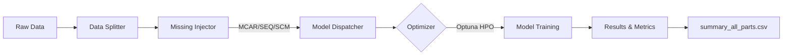

# ST-Missing-Fill: Spatio-Temporal Imputation Benchmark

[](https://www.python.org/downloads/release/python-3120/)
[](https://pytorch.org/)
[](https://opensource.org/licenses/MIT)

**ST-Missing-Fill** 是一个专为时序缺失值构造与插补设计的全流程实验平台。本项目集成了统计学、机器学习及深度学习等多种 SOTA 插补算法，并针对大规模时序数据在 Apple Silicon (MPS) 架构上的计算性能与显存占用进行了极致优化。

---

## 🌟 项目亮点

- **全流程自动化**：一键完成从原始数据加载、动态时间切分、缺失模式模拟到模型自动寻优与结果评估的全过程。
- **深度模型矩阵**：内置 `SAITS`, `iTransformer`, `GRUD` 等前沿深度学习基线，以及专为本项目设计的物理对齐模型 `MyModel` (STAT-Model)。
- **硬件级优化**：针对 MPS (Apple Silicon) 显存瓶颈设计的 **分块向量化 (Block-Vectorization)** 技术，在大规模时序插补中保持 VRAM 极其稳定（4GB~8GB），避免系统僵死。
- **多缺失场景模拟**：支持 `MCAR` (随机)、`SEQ` (时间黑障)、`SCM` (空间相关崩解) 三种工业级缺失模式验证。

---

## 🚀 快速开始 (Usage Workflow)

本项目采用 `uv` 进行包管理，确保环境极致隔离与快速同步。

### 1. 环境准备
```bash
git clone https://github.com/your-repo/st-missing-fill.git
cd st-missing-fill
uv sync
```

### 2. 标准实验流程
我们封装了极简的实验启动脚本，您无需深入底层代码即可启动全量评测。

```bash
# 修改 run_experiments.sh 顶部的模型、时间范围、HPO 轮次等参数
./run_experiments.sh
```

**实验流程内部逻辑：**
1.  **数据层**：从 `data/raw` 加载风速/地形等源数据，并通过 `splitter` 按日期动态切割数据集。
2.  **构造层**：通过 `misser` 向洁净数据中注入指定比例（PI）的受控缺失模式。
3.  **调度层**：启动 **Optuna HPO** 在验证集上寻找最优超构参数（若开启）。
4.  **执行层**：在 MPS/GPU 上完成模型拟合，并按小窗滑动完成全量数据的原位 RMSE 指标评估。

### 3. 长时间挂机运行 (推荐)
对于大规模实验，推荐使用 `nohup` 配合 `caffeinate` 防止 Mac 进入睡眠：
```bash
1. 启动会话
tmux new -s exp


2. 运行实验
caffeinate ./run_experiments.sh


3. 退出但保持运行
按键：
Ctrl + b
d


4. 重新进入
tmux attach -t exp


5. 查看会话
tmux ls


6. 结束会话
tmux kill-session -t exp
```

---

## 🛠️ 核心架构



| 模块 | 核心逻辑路径 | 说明 |
| :--- | :--- | :--- |
| **入口脚本** | `run_experiments.sh` | 实验参数配置（模型、缺失率、HPO 次数） |
| **总调度器** | `src/experiments/runner.py` | 流程编排与循环组合逻辑 |
| **模型分发** | `src/models/dispatcher.py` | 隔离算法实现与 HPO 搜索空间 |
| **物理模型** | `src/models/mymodel/` | 针对 spatio-temporal dynamics 优化的核心模型 |

---

## 📊 支持的模型与缺失
- **Statistical**: `LOCF`
- **Machine Learning**: `KNN`, `MICE` (IterativeImputer)
- **Deep Learning**: `SAITS`, `GRUD`, `iTransformer`
- **Advanced**: `VCAAN`, `STAT_Model` (MyModel)

> [!IMPORTANT]
> **关于 MICE 与 KNN**：项目内部实现了 `Chunk-based Inference` 机制，强制规避了大矩阵插补时的资源死锁与过慢问题。

---

## 📈 结果查看
所有产物均存储于 `logs/` 目录下：
- `logs/summary_all_parts.csv`: 所有运行过的实验最佳成绩汇总表。
- `logs/latest/`: 始终指向最近一次实验产生的可视化图表与详细 CSV 文件。

---

## 📜 许可证
本项目采用 **MIT License**。

如果你觉得本项目对你的研究有帮助，欢迎 **Star** ⭐️。
