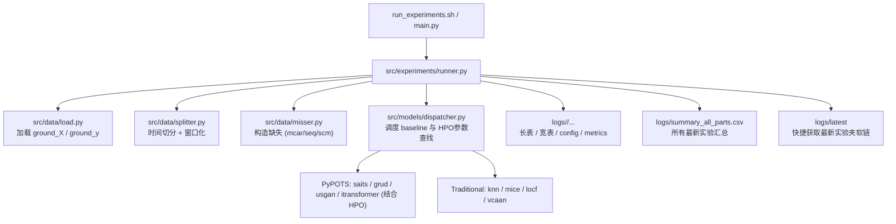

# st-missing-fill

时序缺失构造与插补实验项目。  
当前项目的核心原则是：`main.py` 只做入口调用，具体逻辑放在 `src/` 分层模块中。

## 架构流程图



## 1. 项目组织结构

```text
.
├── main.py                            # 统一入口
├── run_experiments.sh                 # 快捷启动跑批脚本（支持快速改配、改时间、挂载 HPO）
├── pyproject.toml                     # 项目依赖清单
├── src
│   ├── data
│   │   ├── processing.py              # 数据清洗
│   │   ├── load.py                    # 数据加载
│   │   ├── misser.py                  # 缺失构造
│   │   └── splitter.py                # 动态时间集切分
│   ├── models
│   │   ├── dispatcher.py              # 基线与优化统一派发器
│   │   ├── search_space.py            # Optuna HPO 超参搜寻空间
│   │   ├── pypots_baselines.py        # 深度学习基线
│   │   ├── sklearn_baselines.py       # 机器学习基线 
│   │   ├── statistical_baselines.py   # LOCF基线
│   │   └── vcaan.py                   # VCAAN基线
│   ├── experiments
│   │   ├── runner.py                  # 实验大盘编排
│   │   └── results.py                 # 分离的报表生成逻辑
│   └── evaluate.py                    # 纯原位 RMSE 评估
├── data
│   └── raw/processed                  # 隔离的数据资源
└── logs                               # 最新 run 的汇总目录 / 增量报表
```

### 2.1 数据预处理阶段
执行：

```bash
uv run python scripts/run_processing.py
```

作用：
- 合并原始时序数据，生成 `data/processed/all_data.parquet`
- 生成站点信息与 cluster：`data/processed/all_stations.csv`

### 2.2 实验阶段（统一入口）
执行：

```bash
uv run python main.py [args...]
```

调用链：
- `main.py` -> `src/experiments/runner.py`
- runner 内部依次调用：
  - `src/data/load.py` 加载 `ground_X/ground_y`
  - `src/data/splitter.py` 按日期切 train/val/test
  - `src/data/misser.py` 按模式与缺失率构造缺失
  - `src/models/baselines.py` 运行指定 baseline
  - `src/evaluate.py` 计算仅缺失位置 RMSE

固定时间切分：
- Train: `2023-01-01 00:00:00` ~ `2023-12-31 23:50:00`
- Val: `2024-01-01 00:00:00` ~ `2024-06-30 23:50:00`
- Test: `2024-07-01 00:00:00` ~ `2024-12-31 23:50:00`

## 3. 当前支持模型与缺失模式

### 3.1 Baselines
- 深度模型（PyPOTS）：`saits`, `grud`, `usgan`, `itransformer`
- 传统方法：`locf`, `knn`, `mice`
- 自定义：`vcaan`

### 3.2 缺失模式
- `mcar`
- `seq`
- `scm`

## 4. 常用运行方式

我们已废弃了早期繁琐的组合命令或者手写长参数。当前全部参数均在入口脚本顶层暴露！

**最推荐的运行方案：**
```bash
./run_experiments.sh
```
你可以随意打该文件来修改执行配比。包括：支持运行多大范围的数据集（1月到3月等）、需要启动的基线（`locf`等）、以及最重要的：**是否开启带有超参数搜索优化的机制（`--hpo-trials`）**。

## 5. 结果输出文件说明

当启动任意测试后，除了将在 `logs/xxxxx_name/` 下属生成单独文件夹外，系统会：
- 将全局的每次试验都递增写入统括表：`logs/summary_all_parts.csv`
- 创建一个随跑随更新的快捷目录软交点：`logs/latest/`
- `results_pivot.csv`：透视表（train/val/test）
- `config.json`：配置快照
- `metrics.json`：指标摘要

全局汇总：
- `logs/summary.csv`：最新 run 的汇总（浮点保留 4 位）

## 6. 注意事项

- `main.py` 是唯一实验入口，不再依赖 `tests/tmp.py`。
- `KNN/MICE` 已改为分块插补（避免大矩阵一次性插补过慢）。
- `VCAAN` 使用 LOCF 作为预插补，再做迭代优化。
- `mice` 常见 `ConvergenceWarning`，不影响流程执行；若需更稳定可增加迭代次数或调小数据规模。
- `vcaan` 中相关系数计算可能出现 `RuntimeWarning`（常见于低方差列），已做数值兜底处理，流程可继续。

## 7. 环境与依赖

- Python `3.12`
- 包管理：`uv`
- 推荐安装：

```bash
uv sync
```

如需手动安装，保留原依赖清单：

```bash
uv add \
        tqdm pyyaml \
        jupyter notebook ipykernel \
        openpyxl xlrd pyarrow fastparquet \
        numpy pandas scipy \
        matplotlib seaborn folium\
        scikit-learn statsmodels pypots\
        torch torchvision
```
