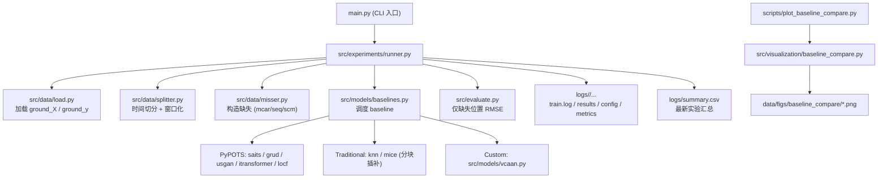

# st-missing-fill

时序缺失构造与插补实验项目。  
当前项目的核心原则是：`main.py` 只做入口调用，具体逻辑放在 `src/` 分层模块中。

## 架构流程图



## 1. 项目组织结构

```text
.
├── main.py                            # 统一入口（参数解析 + 调用实验 runner）
├── scripts
│   ├── run_processing.py              # 原始数据处理入口
│   ├── plot_missing_pattern.py        # 缺失模式可视化
│   └── plot_baseline_compare.py       # baseline 结果可视化入口
├── src
│   ├── data
│   │   ├── processing.py              # 原始数据清洗、合并、站点聚类
│   │   ├── load.py                    # 读取 processed 数据
│   │   ├── misser.py                  # 缺失构造（mcar/seq/scm）
│   │   └── splitter.py                # 时间切分、窗口化
│   ├── models
│   │   ├── baselines.py               # baseline 模型统一调用
│   │   └── vcaan.py                   # VCAAN baseline 实现
│   ├── experiments
│   │   └── runner.py                  # 实验编排、训练评估、结果落盘
│   ├── visualization
│   │   └── baseline_compare.py        # 结果图生成函数
│   └── evaluate.py                    # 评估函数（RMSE on missing positions）
├── data
│   ├── raw                            # 原始数据
│   ├── processed                      # all_data.parquet / all_stations.csv
│   ├── logs                           # 每次实验结果目录 + summary.csv
│   └── figs                           # 可视化图像输出目录
└── tests
    └── tmp.py                         # 暂不使用（占位）
```

## 2. 代码如何运作

### 2.1 数据预处理阶段
执行：

```bash
uv run python scripts/run_processing.py
```

作用：
- 合并原始时序数据，生成 `data/processed/all_data.parquet`
- 生成站点信息与 cluster：`data/processed/all_stations.csv`

### 2.2 实验阶段（统一入口）
执行：

```bash
uv run python main.py [args...]
```

调用链：
- `main.py` -> `src/experiments/runner.py`
- runner 内部依次调用：
  - `src/data/load.py` 加载 `ground_X/ground_y`
  - `src/data/splitter.py` 按日期切 train/val/test
  - `src/data/misser.py` 按模式与缺失率构造缺失
  - `src/models/baselines.py` 运行指定 baseline
  - `src/evaluate.py` 计算仅缺失位置 RMSE

固定时间切分：
- Train: `2023-01-01 00:00:00` ~ `2023-12-31 23:50:00`
- Val: `2024-01-01 00:00:00` ~ `2024-06-30 23:50:00`
- Test: `2024-07-01 00:00:00` ~ `2024-12-31 23:50:00`

## 3. 当前支持模型与缺失模式

### 3.1 Baselines
- 深度模型（PyPOTS）：`saits`, `grud`, `usgan`, `itransformer`
- 传统方法：`locf`, `knn`, `mice`
- 自定义：`vcaan`

### 3.2 缺失模式
- `mcar`
- `seq`
- `scm`

## 4. 常用运行命令

### 4.1 快速 smoke（建议先跑）
```bash
uv run python main.py \
  --models saits \
  --patterns mcar \
  --pis 0.1 \
  --epochs 1 \
  --batch-size 64 \
  --max-windows 32 \
  --run-name smoke
```

### 4.2 多模型 x 三缺失 x 三缺失率（0.1/0.3/0.5）
```bash
uv run python main.py \
  --models locf,saits,grud,usgan,itransformer,knn,mice,vcaan \
  --patterns mcar,seq,scm \
  --pis 0.1,0.3,0.5 \
  --epochs 1 \
  --batch-size 64 \
  --max-windows 32 \
  --run-name all_models_3patterns_135
```

### 4.3 结果可视化（多图输出）
```bash
uv run python scripts/plot_baseline_compare.py
```

默认输出到：
- `data/figs/baseline_compare/`

## 5. 结果输出文件说明

每次 run 会在 `logs/<timestamp>_<run-name>/` 生成：
- `train.log`：完整日志
- `results_long.csv`：长表（model/pattern/pi/split）
- `results_pivot.csv`：透视表（train/val/test）
- `config.json`：配置快照
- `metrics.json`：指标摘要

全局汇总：
- `logs/summary.csv`：最新 run 的汇总（浮点保留 4 位）

## 6. 注意事项

- `main.py` 是唯一实验入口，不再依赖 `tests/tmp.py`。
- `KNN/MICE` 已改为分块插补（避免大矩阵一次性插补过慢）。
- `VCAAN` 使用 LOCF 作为预插补，再做迭代优化。
- `mice` 常见 `ConvergenceWarning`，不影响流程执行；若需更稳定可增加迭代次数或调小数据规模。
- `vcaan` 中相关系数计算可能出现 `RuntimeWarning`（常见于低方差列），已做数值兜底处理，流程可继续。

## 7. 环境与依赖

- Python `3.12`
- 包管理：`uv`
- 推荐安装：

```bash
uv sync
```

如需手动安装，保留原依赖清单：

```bash
uv add \
        tqdm pyyaml \
        jupyter notebook ipykernel \
        openpyxl xlrd pyarrow fastparquet \
        numpy pandas scipy \
        matplotlib seaborn folium\
        scikit-learn statsmodels pypots\
        torch torchvision
```
